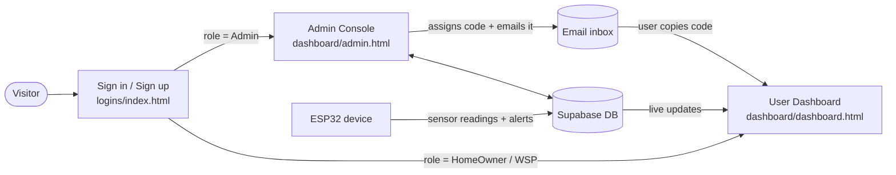
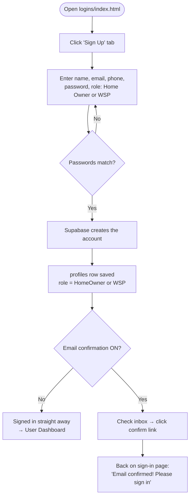
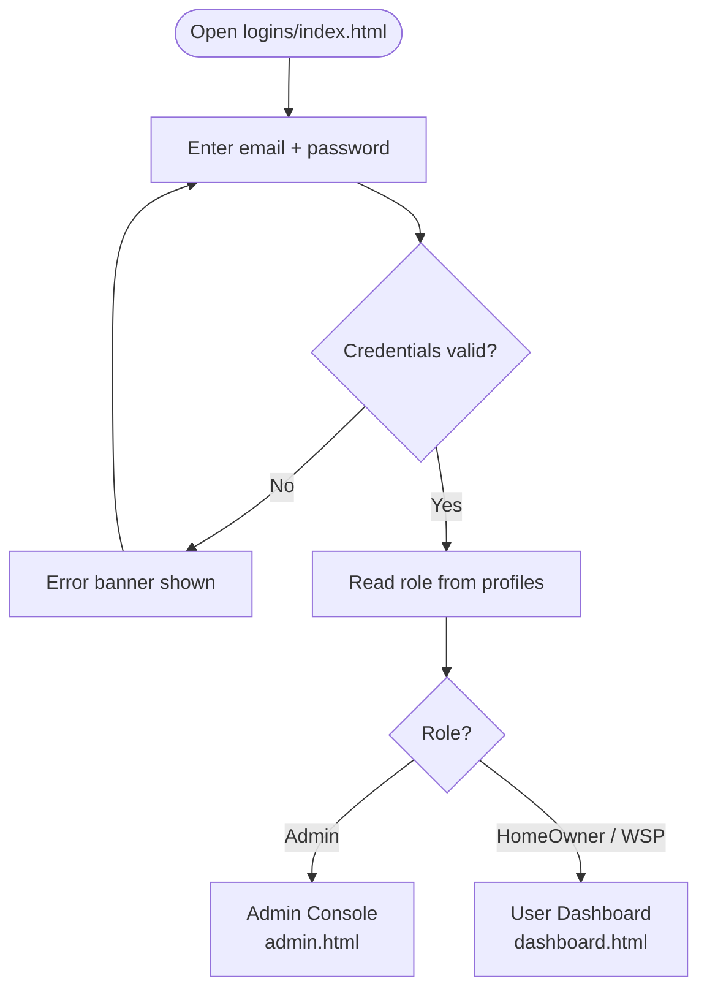
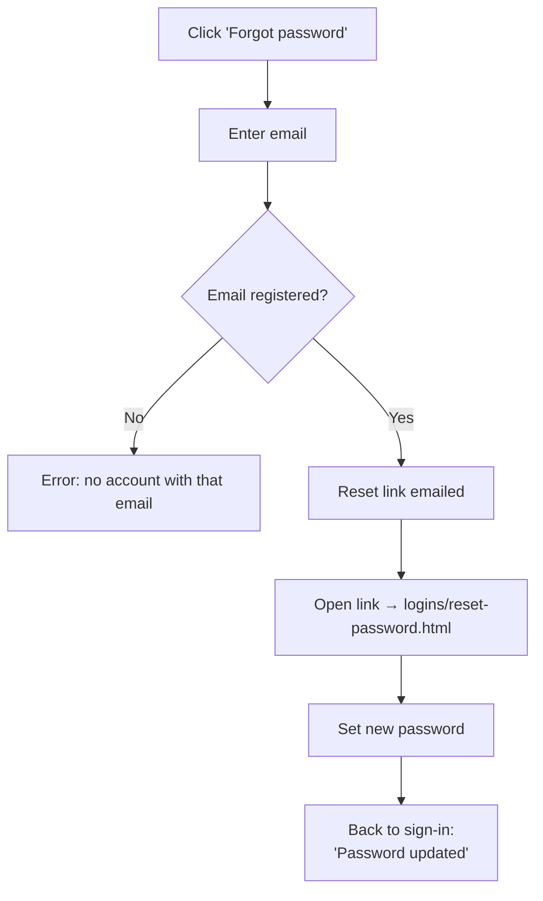
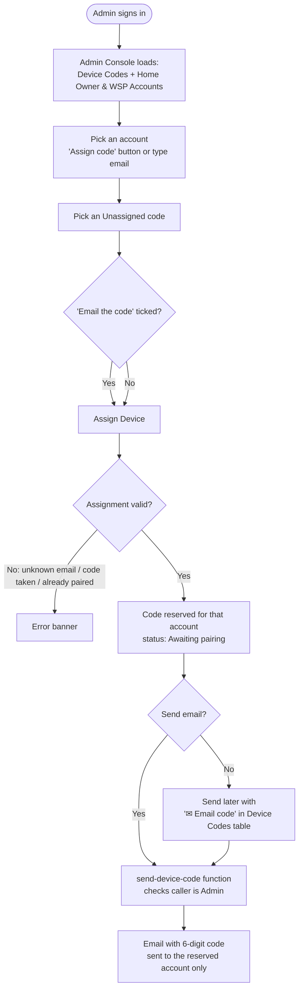
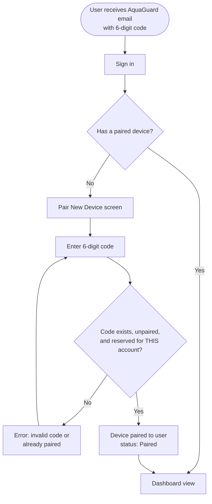
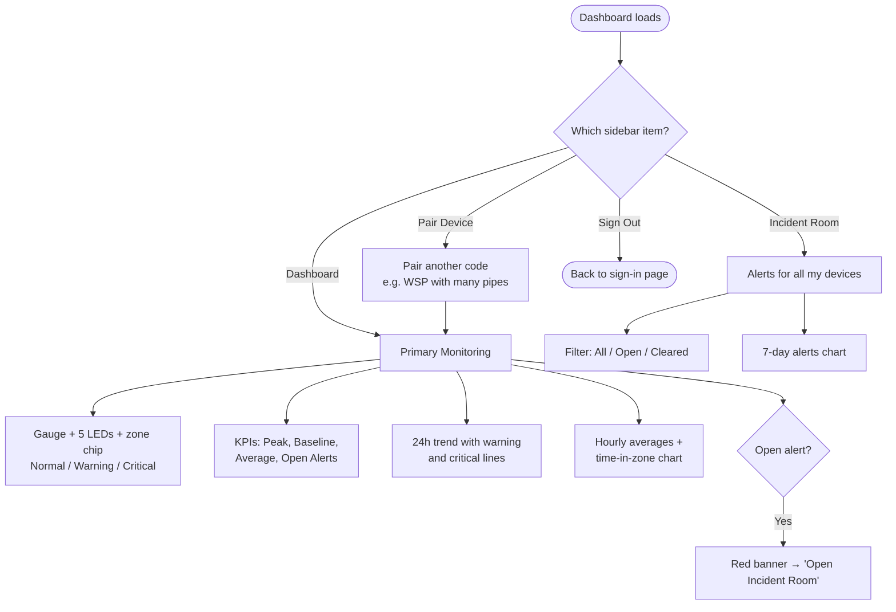
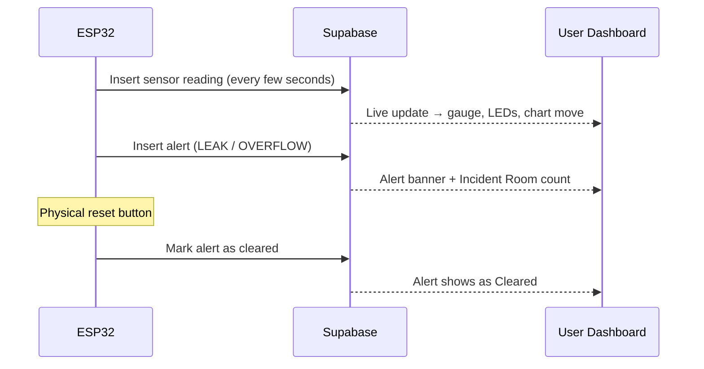
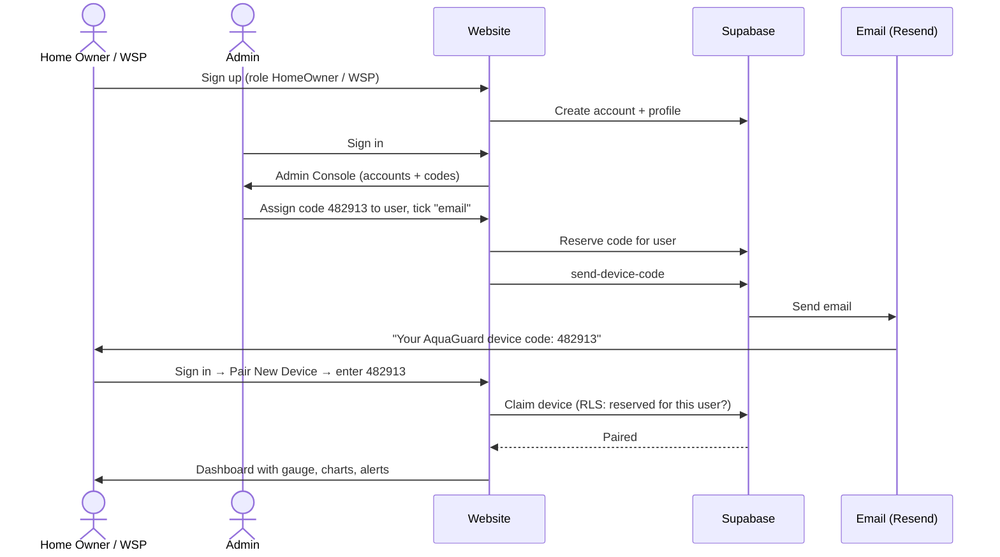

# AquaGuard — Activity Flow

How a person moves through the system, from the sign-in page onwards.
Open the Markdown Preview (`Ctrl+Shift+V`) to see the diagrams.

---

## 1. The big picture

| Actor | What they do |
|---|---|
| **Home Owner / WSP** | Signs up, waits for a code by email, pairs the device, watches the dashboard |
| **Admin** (justus.kamande@strathmore.edu) | Sees all registered Home Owner/WSP accounts, assigns device codes, emails them |
| **ESP32 device** | Sends pressure readings and leak/overflow alerts to Supabase |
| **Supabase** | Login, database, security rules (RLS), live updates, email function |

---

## 2. Sign up

> Nobody can sign up as Admin. The Admin role is only granted by running `sql/make_admin.sql`.

---

## 3. Sign in and role routing

Both pages re-check the role when they load:
- A non-admin who opens `admin.html` is sent to `dashboard.html`.
- An admin who opens `dashboard.html` is sent to `admin.html`.
- Anyone not signed in is sent back to the sign-in page.

### Forgot password

---

## 4. Admin: hand out a device code

**Code status in the Device Codes table**

| Status | Meaning | Action available |
|---|---|---|
| Unassigned | Free code, nobody holds it | Assign |
| Awaiting pairing | Reserved for one account, not entered yet | ✉ Email code (send / resend) |
| Paired | The account entered the code — device is live | — |

---

## 5. User: receive code → pair → dashboard

> The check in the diamond is enforced by the database (RLS), so a code emailed to one person cannot be used by anyone else.

---

## 6. Using the dashboard

- **Device picker** (top right) appears when the account has 2+ devices — mainly WSPs.
- **Live updates:** new readings move the gauge, LEDs, KPIs and trend line without a refresh. New alerts show the banner and update the Incident Room count.

### Pressure zones (same rules on the website and the ESP32)

| Position in the pressure range | Zone | Gauge / LEDs |
|---|---|---|
| 0 – 60 % | Normal | Green |
| 60 – 85 % | Warning | Amber |
| 85 – 100 % | Critical | Red |

---

## 7. Device data flow (once the ESP32 is built — Phase 3)

---

## 8. End-to-end summary

---

## Setup that must be done before this flow works

1. Supabase SQL Editor, in order: `admin_assign_device.sql` → `admin_panel_functions.sql` → `make_admin.sql` → `synthetic_data.sql`
2. Deploy the `send-device-code` Edge Function and set `RESEND_API_KEY`, `EMAIL_FROM`, `SITE_URL`
3. Resend only delivers to your own address until you verify a sending domain
